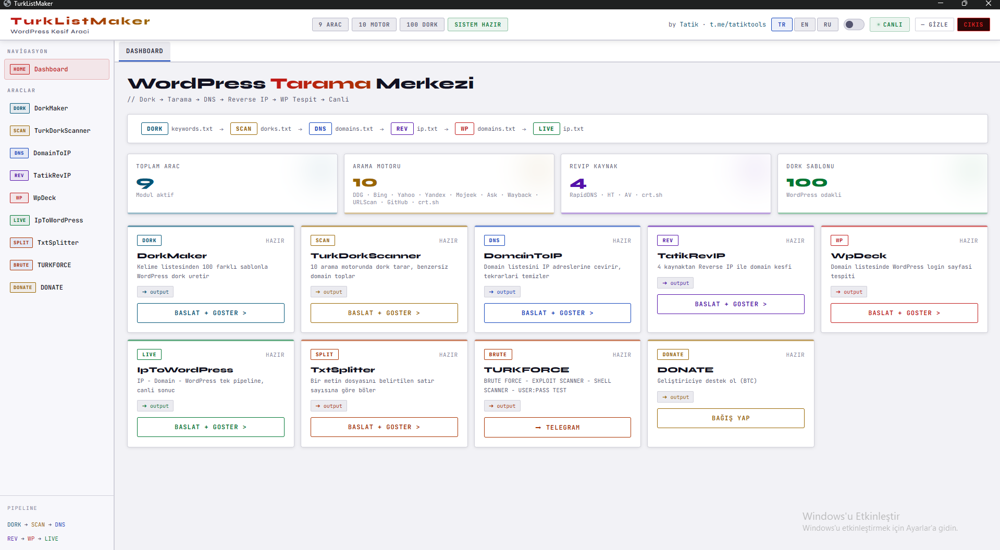

# TurkListMaker-Dork-Maker--Dork-Scanner-DOM2IP-IP2DOM-WP-CHECK

**TurkListMaker**, WordPress sitelerini tespit etmek, domain toplamak ve reverse IP yapmak için geliştirilmiş bir masaüstü aracıdır.

# TurkListMaker

**TurkListMaker** is a desktop tool developed to detect WordPress sites, collect domains, and perform reverse IP lookups.

> ⚠️ **Warning**: This tool is intended solely for educational and authorized testing purposes. Unauthorized use may be illegal. You are solely responsible for any consequences resulting from its use.

## Features
🛠️ MODÜLLER & ÖZELLİKLER / MODULES & FEATURES:
✅ DorkMaker & Scanner: Fast and accurate dorking / Hızlı ve keskin dork işlemleri.
✅ Domain ↔ IP & RevIP: Quick target analysis / Hızlı hedef analizi.
✅ WP Check & IP → WP: Mass WordPress infrastructure validation / Toplu WP doğrulama.
✅ TxtSplitter & TxtMerger: Manage large data lists easily / Büyük veri yönetimi.
✅ Performance: High-speed Multi-Threading / Maksimum işlem hızı.
✅ Custom UI: 3 Languages & Light/Dark Themes / 3 Dil Desteği ve 2 Tema seçeneği.

## Usage
1. Run the `TurkListMaker.exe` file you downloaded.
2. Your browser will automatically open the dashboard (usually `http://localhost:19821`).
3. Select the tool you want and start it.

## Download
📥 İNDİR / DOWNLOAD: https://tatik.co
📢 DUYURULAR & DESTEK / UPDATES: https://t.me/tatiktools

⚠️ NOTE:Please report bugs or suggestions via Telegram. All future updates and the TURKFORCE launch will be shared exclusively on our channel!

